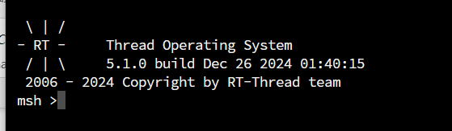
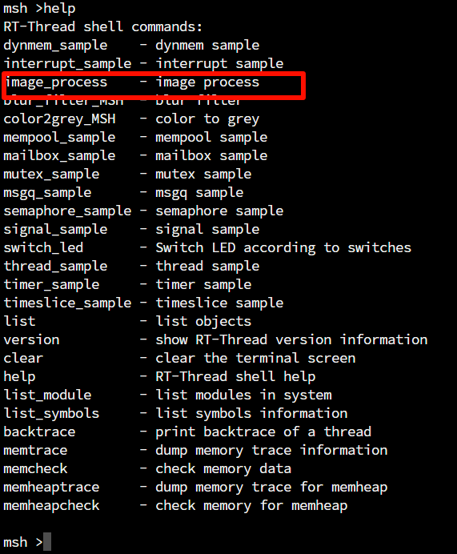
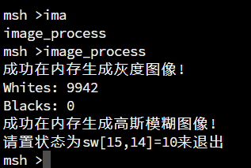
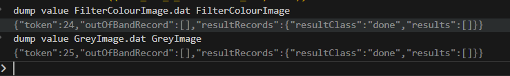

# 基于RT-Thread5.10移植Nexys A7 FPGA实现图像处理应用
## 项目简介
该项目实现了将RT-Thread 5.10内核移植到 Nexys A7 FPGA开发板(RISC-V架构)上，在该系统上实现了Shell以及图像处理程序。该项目同样是武汉大学嵌入式系统课间实验。同时添加了RT-thread官方文档的测试用例，它可以通过终端调用。

## 环境配置
### 平台安装
该项目需要借助VScode的PlatformIO平台，使用前需要在VSCode安装PlatformIO，准备好RISC-V平台，我们借助`swervolf_nexys`内核。
### 内存布局修改
同时用该项目下的`link.lds`替换`C:\Users\<YourName>\.platformio\packages\framework-wd-riscv-sdk\board\nexys_a7_eh1`下对应文件，注意路径中的`<YourName>`要替换成你的Windows电脑用户名。
### platformio.ini修改
把几个`build_flags = -I`inlcude的路径改成你保存该项目对应的路径地址

## 项目结构
- asset: 资源文件夹，包括图像处理的源图片，以及图片数组化，dat文件转化成bmp的代码文件。
- include: 头文件，包括psp，板载文件，和RT-Thread文件。
- src: 源文件，包括板载文件，驱动文件和RT-Thread文件等。
  在该目录下有·applications·文件夹，这里添加了官方测试用例和图像处理程序源文件。

## 使用流程
1. 点击`asset`目录下的`image_to_c.exe`，将`asset/input.png`转换成`src/applications/output.c`里的C语言数组。

2. 启动项目，连接到板子的UART串口，选择波特率为115200，可以看到终端输出：



3. 使用help命令：



确实能找到我们实现的图像处理程序。

4. 调用命令处理图像，相关信息：



5. 使用dump命令，导出内存的灰度图数组和高斯模糊数组：
```
cd asset
dump value GreyImage.dat GreyImage
dump value FilterColourImage.dat FilterColourImage
```

	
6. 最后点击`asset`目录下`to_bmp.dat`会自动调用`dat2bmp.exe`将两个dat转成bmp文件(分别是单通道和三通道的)。

7. 最终效果：原图为：

 

灰度图：


高斯模糊图片：


 	
## 与板载资源交互
除了图像处理，我还额外写了两个测试用例，一个是跑马灯，一个是led_switch。这两个会与板载资源(Led, 七段数码管, 拨钮)进行交互。分别通过命令`led_marquee`和`switch_led`调用，具体代码实现可以看application文件夹下的对应代码文件内的内容。一个实现跑马灯，一个你拨拨钮后，对应的led会亮，然后七段数码管显示第几个拨钮。

下面是默认的PlatformIO项目的启动说明:

How to build PlatformIO based project
=====================================

1. [Install PlatformIO Core](https://docs.platformio.org/page/core.html)
2. Download [development platform with examples](https://github.com/platformio/platform-chipsalliance/archive/develop.zip)
3. Extract ZIP archive
4. Run these commands:

```shell
# Change directory to example
$ cd platform-chipsalliance/examples/rtosal-freertos

# Build project
$ pio run

# Upload firmware
$ pio run --target upload

# Build specific environment
$ pio run -e swervolf_nexys

# Upload firmware for the specific environment
$ pio run -e swervolf_nexys --target upload

# Clean build files
$ pio run --target clean
```
